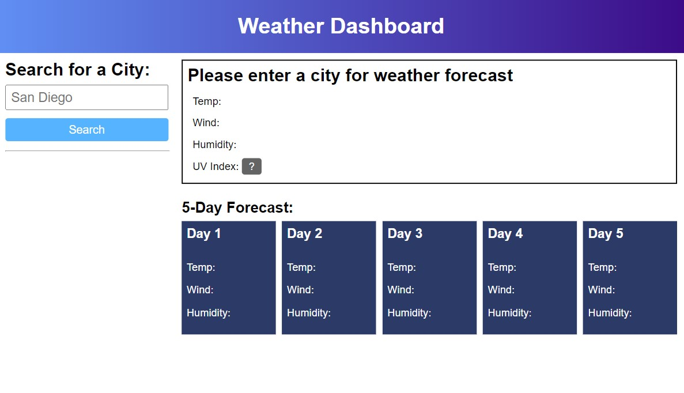
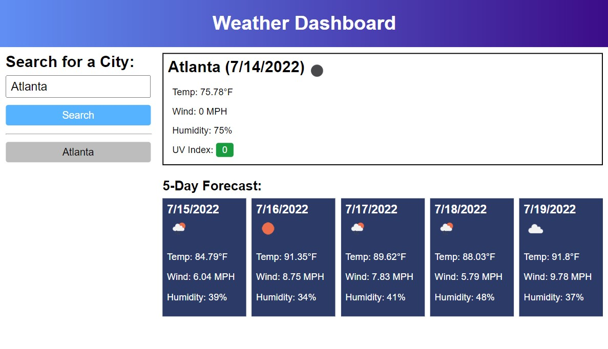
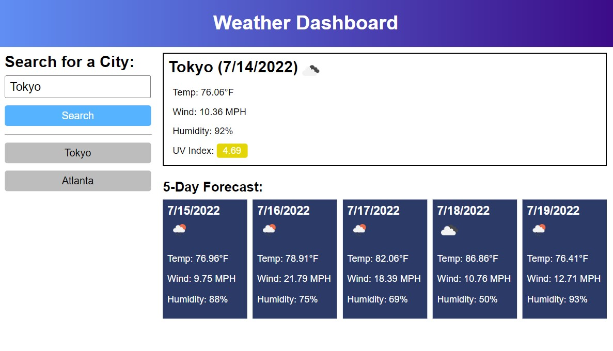
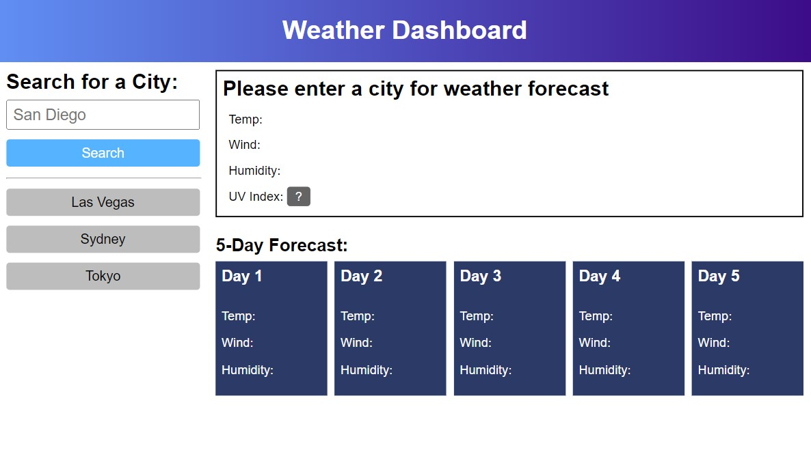

# weather-dashboard
This weather dashboard displays the city's current and future conditions such as temperature, wind speed, humidity, and UV index. 

## Description
How to use the weather dashboard:
1. Enter any city into the input box and click on the `search` button.
2. The city's current and future conditions displays on the right.
3. UV Index's label can change color to indicate different levels of severity: green - low, yellow - moderate, orange - high, red - very high, purple - extreme.
4. Search history is provided. Clicking on any previously-searched `city` buttons will bring up that city's current and future conditions.

## Usage
Click [here](https://christylex3.github.io/weather-dashboard/) to try out the weather dashboard to help plan your trips!
> Note: If API requests are blocked, you are welcome to `git clone` the [respository](https://github.com/christylex3/weather-dashboard).

## Additional Pictures
Figure 1: Here is how the application looks when launched.

Figure 2: This shows Atlanta's current and future conditions when user enters "Atlanta" in the search.

Figure 3: This demonstrates the UV index label changing colors at a certain number.

Figure 4: Search history is not lost even if page refreshes. (Look underneath the search button)
